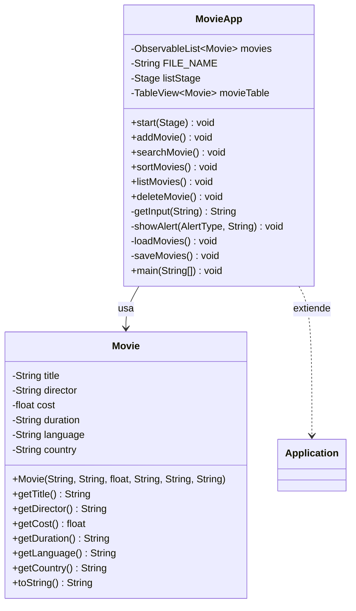

# Registro de Películas (MovieApp)

[](https://openjfx.io/) [](https://www.oracle.com/java/)

## 📋 Tabla de Contenidos

- [Descripción](#descripción)
- [Características](#características)
- [Requisitos](#requisitos)
- [Instalación](#instalación)
- [Uso](#uso)
  - [Interfaz Principal](#interfaz-principal)
  - [Agregar Película](#agregar-película)
  - [Buscar Película](#buscar-película)
  - [Ordenar Películas](#ordenar-películas)
  - [Listar Todas](#listar-todas)
  - [Eliminar Película](#eliminar-película)
- [Arquitectura](#arquitectura)
  - [Diagrama de Clases (UML)](#diagrama-de-clases-uml)
  - [Diagrama de Flujo General](#diagrama-de-flujo-general)
  - [Diagrama de Flujo por Operación](#diagrama-de-flujo-por-operación)
- [Estructura del Código](#estructura-del-código)
  - [Clase Principal: `MovieApp`](#clase-principal-movieapp)
  - [Clase de Datos: `Movie`](#clase-de-datos-movie)
  - [Métodos Detallados](#métodos-detallados)
- [Persistencia de Datos](#persistencia-de-datos)
- [Limitaciones y Mejoras Posibles](#limitaciones-y-mejoras-posibles)
- [Contribuir](#contribuir)
- [Licencia](#licencia)

## Descripción

**MovieApp** es una aplicación de escritorio simple y ligera desarrollada en **Java** con **JavaFX** para la interfaz gráfica. Permite gestionar un registro personal de películas, incluyendo operaciones CRUD básicas (Crear, Leer, Actualizar indirectamente vía ordenamiento, Eliminar). Los datos se almacenan de forma persistente en un archivo de texto plano (`movies.txt`) en el directorio raíz de la aplicación.

Esta app es ideal para usuarios principiantes en JavaFX que deseen un ejemplo práctico de manejo de listas observables, diálogos de entrada, tablas dinámicas y persistencia básica. No requiere bases de datos externas; todo es local y autónomo.

**Versión:** 1.0  
**Autor:** ResmicDewitt
**Fecha:** Noviembre 2025

## Características

- **Agregar Películas:** Ingreso de título, director, costo (float), duración, idioma y país. Verificación de duplicados por título.
- **Buscar Películas:** Búsqueda por título (insensible a mayúsculas/minúsculas).
- **Ordenar Películas:** Por título, director, costo, duración, idioma o país (ascendente).
- **Listar Películas:** Visualización en una tabla interactiva en ventana separada, con scroll y redimensionamiento automático.
- **Eliminar Películas:** Eliminación por título exacto.
- **Persistencia Automática:** Carga al inicio y guarda al salir.
- **Interfaz Intuitiva:** Diálogos nativos de JavaFX para entradas y alertas, sin complejidades.
- **Manejo de Errores:** Validación de entradas (e.g., costo numérico) y alertas informativas.

## Requisitos

- **Java:** JDK 8 o superior (recomendado: 11+ para mejor compatibilidad con JavaFX).
- **JavaFX:** Obligatorio (incluido en JDK 8-10; para JDK 11+, descargar por separado desde [OpenJFX](https://openjfx.io/)).
  - ⚠️ **Indispensable:** Configura el classpath con `--module-path /path/to/javafx/lib --add-modules javafx.controls,javafx.fxml` al compilar/ejecutar.
- **Entorno de Desarrollo:** IDE como IntelliJ IDEA, Eclipse o VS Code con extensión Java.
- **Sistema Operativo:** Windows, macOS o Linux (cross-platform gracias a JavaFX).

## Instalación

1. **Clona o Descarga el Código:**
   - Crea un directorio para el proyecto: `mkdir MovieApp && cd MovieApp`.
   - Guarda el código proporcionado en un archivo `MovieApp.java`.

2. **Configura JavaFX (si usas JDK 11+):**
   - Descarga JavaFX SDK desde [Glounchpad](https://gluonhq.com/products/javafx/).
   - Extrae a una carpeta, e.g., `/opt/javafx-sdk-21`.

3. **Compilación:**
   - En terminal:  
     ```bash
     javac --module-path /opt/javafx-sdk-21/lib --add-modules javafx.controls,javafx.fxml MovieApp.java
     ```

4. **Ejecución:**
   - En terminal:  
     ```bash
     java --module-path /opt/javafx-sdk-21/lib --add-modules javafx.controls,javafx.fxml MovieApp
     ```
   - En IDE: Configura VM options con los flags de módulo arriba.

5. **Archivo de Datos:** Se crea automáticamente `movies.txt` en el directorio actual.

## Uso

### Interfaz Principal

Al iniciar, se abre una ventana simple con botones verticales:

- **Agregar Película** → Lanza diálogos secuenciales para ingresar datos.
- **Buscar Película** → Diálogo para título; muestra alerta con detalles o "No encontrado".
- **Ordenar Películas** → Diálogo de selección (ChoiceDialog) para campo; ordena la lista in-place.
- **Listar Todas** → Abre/trae al frente una ventana con tabla de películas (si hay datos).
- **Eliminar Película** → Diálogo para título; elimina y confirma.
- **Salir** → Guarda cambios y cierra todas las ventanas.

**Ejemplo de Flujo Inicial:**
1. Inicia la app → Carga `movies.txt` (vacío si no existe).
2. Agrega películas → Aparecen en memoria.
3. Lista → Ve la tabla actualizarse en tiempo real.

### Agregar Película

- Ingresos: Título (string, único), Director (string), Costo (float, e.g., 12.50), Duración (string, e.g., "120 min"), Idioma (string, e.g., "Inglés"), País (string, e.g., "EE.UU.").
- Validaciones: Duplicado por título (case-insensitive), costo numérico.
- Resultado: Agrega a la lista observable; alerta de éxito.

### Buscar Película

- Ingreso: Título.
- Búsqueda: Lineal en la lista (O(n)).
- Resultado: Alerta con `toString()` de la película o "No encontrada".

### Ordenar Películas

- Selección: Diálogo con opciones (Título, Director, Costo, etc.).
- Ordenamiento: Usa `Comparator` basado en getters; modifica la lista observable (tabla se actualiza automáticamente).
- Nota: Ascendente siempre; case-insensitive para strings.

### Listar Todas

- Ventana Separada: Stage con TableView enlazada a `movies`.
- Columnas: Título, Director, Costo, Duración, Idioma, País.
- Comportamiento: Crea una sola vez; reutiliza y trae al frente. Scrollable, redimensiona columnas automáticamente.
- Si vacío: Alerta "No hay películas".

### Eliminar Película

- Ingreso: Título.
- Eliminación: Iterator para remover seguro (actualiza ObservableList y tabla).
- Resultado: Alerta de éxito o "No encontrada".

## Arquitectura

La app sigue un patrón **MVC simplificado**:
- **Model:** `Movie` (datos) + `ObservableList<Movie>` (colección observable).
- **View:** VBox principal + TableView + Diálogos/Alerts.
- **Controller:** Métodos en `MovieApp` que manejan eventos y lógica.

### Diagrama de Clases (UML)

Usando notación textual (Mermaid-like para Markdown):



### Diagrama de Flujo General

Flujo ASCII art:

```
[Inicio App] --> [loadMovies()] --> [Ventana Principal con Botones]
                  |
                  +--> [Botón Acción] --> [Diálogo/Entrada] --> [Lógica (add/search/etc.)] --> [Actualiza Lista Observable]
                  |                                           |
                  +--> [listMovies()] --> [Crear/Mostrar TableView] <--> [ObservableList (binded)]
                  |
[Salir] <-- [saveMovies()] <-- [Cerrar Ventanas]
```

### Diagrama de Flujo por Operación

**Agregar (Ejemplo):**
```
getInput(Título) --> ¿Vacío/Duplicado? --> Sí: Alerta & Return
                    No: getInput(Director) --> getInput(Costo) --> ¿Float Válido? --> No: Alerta
                                                              Sí: getInput(Duración/Lenguaje/País)
                                                              |
                                                              v
[Crear Movie] --> [add to movies] --> Alerta Éxito
```

**Ordenar:**
```
ChoiceDialog(Campo) --> ¿Seleccionado? --> No: Return
                       Sí: Switch(Comparator) --> [movies.sort(comparator)] --> Alerta
```

**Listar:**
```
¿movies.empty() & listStage==null? --> Sí: Alerta Vacío
                                    No: ¿listStage==null? --> Sí: [Crear Stage + TableView + Bind Items] 
                                                                                 |
                                                                                 v
[Show/ToFront Stage] <--> [Tabla Actualiza Auto vía Observable]
```

## Estructura del Código

El código está en un solo archivo `MovieApp.java` para simplicidad (puede refactorizarse).

### Clase Principal: `MovieApp`

Extiende `Application` de JavaFX. Maneja toda la lógica de UI y datos.

- **Campos Privados:**
  - `ObservableList<Movie> movies`: Lista reactiva para binding con TableView.
  - `String FILE_NAME = "movies.txt"`: Ruta del archivo de persistencia.
  - `Stage listStage`: Referencia a ventana de lista (singleton-like).
  - `TableView<Movie> movieTable`: Tabla enlazada a `movies`.

### Clase de Datos: `Movie`

POJO simple con propiedades JavaFX-compatibles (getters para CellValueFactory).

- **Atributos:** title (String), director (String), cost (float), duration (String), language (String), country (String).
- **Constructor:** Todo los campos.
- **Getters:** Públicos para UI.
- **toString():** Formato legible para alertas.

### Métodos Detallados

| Método | Descripción | Parámetros | Retorno | Notas |
|--------|-------------|------------|---------|-------|
| `start(Stage primaryStage)` | Punto de entrada JavaFX. Carga datos, crea UI principal. | Stage | void | Llama `loadMovies()`. |
| `addMovie()` | Maneja adición con validaciones. | - | void | Usa `getInput()` x6; chequea duplicados. |
| `searchMovie()` | Búsqueda lineal por título. | - | void | Muestra `toString()` o no encontrado. |
| `sortMovies()` | Diálogo + Comparator + sort(). | - | void | Opciones: 6 campos; case-insensitive para strings. |
| `listMovies()` | Crea/muestra TableView si datos. | - | void | Binding directo; políticas de resize. |
| `deleteMovie()` | Remoción vía Iterator. | - | void | Actualiza lista auto. |
| `getInput(String header)` | Diálogo de texto genérico. | header (prompt) | String | Null si cancelado. |
| `showAlert(AlertType type, String message)` | Alerta estándar. | type, message | void | Título fijo "Información". |
| `loadMovies()` | Lee archivo, parsea líneas por `\|`. | - | void | Ignora líneas inválidas; inicia vacío si error. |
| `saveMovies()` | Escribe lista a archivo. | - | void | Llama al salir; maneja IOException. |
| `main(String[] args)` | Lanza app. | args | void | Estándar. |

## Persistencia de Datos

- **Formato:** Una línea por película: `Título\|Director\|Costo\|Duración\|Idioma\|País` (e.g., `Inception\|Nolan\|150.0\|148 min\|Inglés\|EE.UU.`).
- **Carga:** `BufferedReader` + split(`\\|`); try-catch para float.
- **Guardado:** `BufferedWriter` + write() + newLine(); al cerrar app.
- **Ubicación:** `./movies.txt` (directorio de ejecución).
- **Errores:** Logs a stderr; app inicia vacía si falla.

## Limitaciones y Mejoras Posibles

- **Limitaciones:**
  - Búsqueda/Eliminación solo por título (no parcial).
  - Sin edición directa (solo delete + add).
  - Ordenamiento solo ascendente y sin múltiples criterios.
  - Persistencia básica: No soporta concurrencia ni backups.
  - UI simple: No validaciones avanzadas (e.g., costo >0).

- **Mejoras Sugeridas:**
  - Agregar edición en TableView (doble-click).
  - Búsqueda avanzada (por director/país).
  - Exportar a CSV/JSON.
  - Filtros en tabla (e.g., por idioma).
  - Iconos/imágenes de películas (via FileChooser).
  - Migrar a base de datos (SQLite) para escalabilidad.

## Contribuir

1. Forkea el repo.
2. Crea branch: `git checkout -b feature/nueva-funcion`.
3. Commit: `git commit -m 'Agrega X'`.
4. Push: `git push origin feature/nueva-funcion`.
5. Abre Pull Request.

¡Agradecemos contribuciones! Reporta issues para bugs.

## Licencia

Este proyecto está bajo la Licencia MIT. Ver [LICENSE](LICENSE) para detalles.

---


